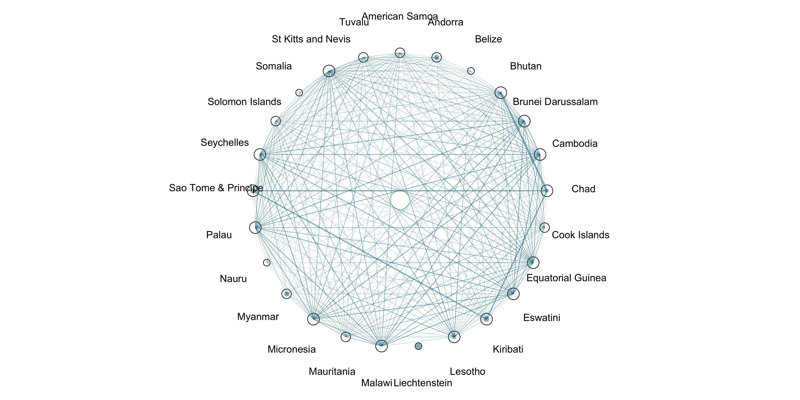

<h1 align="center">2024 Paris Olympic Network Analysis</h1>

#### Jangmin Song  
#### Professor Carrie Diaz Eaton  
#### DCS375 Network Analysis  
#### April 18th, 2025  

## 1. Introduction  
&nbsp;&nbsp;&nbsp;&nbsp;The Summer Olympic Games is the largest international sport event, which is held every four years. There are more than 10,000 athletes from around the world participate in this event. These athletes train for years to represent their nations on a global stage and compete for their best in events. In 2024, the Olympics game was held in Paris three years after 2020 Tokyo Olympics that happened in 2021 due to COVID-19 pandemic. I was reading through the article called [Unveiling the Numbers: Fascinating Data Insights from the 2024 Olympics](https://medium.com/@gilipalo/unveiling-the-numbers-fascinating-data-insights-from-the-2024-olympics-d839060db060) by [Francesco Giliberti](https://medium.com/@gilipalo), and this made me interested in doing a Network Analysis about 2024 Paris Olympics. In the article, the author mentioned about the a dataset in [kaggle.com](https://www.kaggle.com/) called [Paris 2024 Olympic Summer Games](https://www.kaggle.com/datasets/piterfm/paris-2024-olympic-summer-games?select=medallists.csv), which contains all the data of athletes and medaliests, thus I also decided to use this dataset. The dataset can be used for exploring global athletic participation, collaboration, and structural patterns across countries and disciplines. My project uses network analysis methods to investigate athlete and country relationships based on shared events, medal achievements, and crossdiscipline participation. 

&nbsp;&nbsp;&nbsp;&nbsp;The central questions of this project are the followings:
- How are athletes socially connected through shared Olympic disciplines and events?
- Which countries are central nodes in the global disciplines network?
- Do certain disciplines have deepen interconnections between athletes or countries?

&nbsp;&nbsp;&nbsp;&nbsp;I used the language `R` for this project mainly using `bipartite`, `igraph`, and `ggplot2` packages. By visualizing and analyzing these relationships through bipartite graphs, one-mode projections, and centrality metrics, we will find the structural dynamics within the Olympic system from the competition results dataset.

## 2. Background and Significance
&nbsp;&nbsp;&nbsp;&nbsp;The Olympic Games are not only an event for international sports competition but also it is a representation of global athletic development and cultural investment in sports. Countries have different numbers of how many athletes they send and what disciplines they participate in. I hypothesized that we can potentially find some deeper patterns about the features of athletic ministries in each country and accessibility.

&nbsp;&nbsp;&nbsp;&nbsp;By building the networks and visualizing the relationships between athletes, countries, and disciplines as networks, we can explore who and what are connected, how central certain nodes are, and where clusters of similarity or collaboration might happen. Concepts like bipartite graphs and degree centrality, which was learned through DCS 375 Network Analysis class allow us to map these interactions and quantify research in ways traditional medal counts do not. This project applies those techniques to the 2024 Paris Olympics dataset to better understand the collaborative structure of global athletics.

## 3. Data and Data Ethics
&nbsp;&nbsp;&nbsp;&nbsp;Now let’s talk about data. As mentioned in introduction, datasets are from [kaggle.com](https://www.kaggle.com/) and are called `athletes.csv` (all participants) and `medallists.csv` (all medal winners) from [Paris 2024 Olympic Summer Games](https://www.kaggle.com/datasets/piterfm/paris-2024-olympic-summer-games?select=medallists.csv) by the main contributer [piterfm](https://www.kaggle.com/piterfm). It includes detailed information on all Olympic athletes and medalists, such as name, discipline, country, and medal type.. `athletes.csv` contains variables such as `name`, `gender`, `country`, `disciplines`, `events`, `birth date`, `occupation`, `education`, etc.  `medallists.csv` has information about `medal_date`, `medal_type`, `name`, `country`, etc. In the data cleaning phase, I removed special characters such as brackets, quotation marks from `disciplines` and `events` . Also, I created a new dataset that contains only the variables that I plan to use. 

&nbsp;&nbsp;&nbsp;&nbsp;The dataset is available publicly on Kaggle. However, it is important to use the data ethically since it contains personal data. As mentioned above, the dataset includes personal information such as athlete names, birth dates, and even education or occupation. I strongly believe that even though athletes compete in public, using their data and analyzing needs to ahve careful consideration of their respect and privacy. As Danah Boyd and Kate Crawford say in Six Provocations for Big Data, “Just Because it is Accessible Doesn’t Make it Ethical”(Boyd & Kate Crawford, 10), public data can still raise privacy concerns if it’s taken out of its original context. I ensured that the data was used only for educational purposes, and I focused on overall patterns. I have mentioned specific athletes several times because of their outstanding work, which was pupblic to the world. 

## 4. Methodology, Visualizations, and Analysis/Observation
&nbsp;&nbsp;&nbsp;&nbsp;After the data cleaning, I applied several network analysis skills learned in the DCS375 course. I have created a bipartite network, unimodal visualizations, projected unipartite network, 1-mode network, and barplot. I have also used statistical analysis for the 1-mode network. Here are methodologies and analysis/observation for each visualization.  

1. **Athlete–Country Bipartite Network**
   
&nbsp;&nbsp;&nbsp;&nbsp;Using `frame2webs()` from the `bipartite` package, I created a bipartite graph connecting athletes to their respective countries and disciplines. This two mode network highlights participation patterns across countries. The `plotweb()` function was used for visualization. I used the method explained in *Using bipartite to describe and plot two-mode networks in R* by Carsten F. Dormann, specifically in *Chapter 4: Visualising bipartite networks* (Dormann). Here is the bipartite graph of countries and disciplines. 

&nbsp;&nbsp;&nbsp;&nbsp; I have noticed that we cannot able to see some nodes because they are too small on the bottom left part. To reduce noise, I grouped countries with 15 or fewer athletes into a “Other Countries” node. 

**Analysis/Observation**:

&nbsp;&nbsp;&nbsp;&nbsp;I observed that There are a lot of participants in Athletics and Swimmings from many countries. I also see that there are many participants from the countries like US, France, China, Australia, Japan, and Spain. Lastly, I found that there are many countries that have only sent 15 or less athletes because "Other Countries" node is thick. 

2. **Barplots of Athlete Representation by Country**
   
&nbsp;&nbsp;&nbsp;&nbsp;I used `ggplot2` to create horizontal bar plots showing the number of athletes from each country. One plot showed the top 20 countries by participation, while another showed the bottom 20. These visualizations gives context for understanding the structure of the collaboration networks in later visualizations.

**Analysis/Observation**:

&nbsp;&nbsp;&nbsp;&nbsp;I found out that the many developed countries sent many athletes, while other countries that have few populations or small country size have sent less athletes. USA has sent the most athltes to Paris Olympic and had 619 athletes, while Belize, Liechtenstein, Nauru, and Somalia had 1 athlte representing from each country. It is very sad to see how there are massive difference between those countries.

3. **Bipartite Participation Network of Bottom 20 Countries**
   
&nbsp;&nbsp;&nbsp;&nbsp;I was curious about what disciplines athletes attend if their country has very few participants, and whether these smaller athletes attending countries share similarities. To find out this curiosity, using the filtered data from the previous section, I created a bipartite network connecting countries by Olympic disciplines. I filtered the dataset to include only the bottom 20 countries by athlete count. Using the `plotPAC()` functions from the `bipartite` package, I visualized the connections between these countries and their attended disciplines. 

**Analysis/Observation**:

&nbsp;&nbsp;&nbsp;&nbsp;Most of the countries share one discipline. Some countries share multiple disciplines. For example, Bhutan and Chad share Archery and Athletics, and Sao Tome and Principe and Chad share Athletics and Judo. Liechtenstein did not share any discipline with any of the other few athletes attending countries, and in fact, PUENTENER Romano was the only athlete attended this Olympic from Liechtenstein and competed in Cycling Mountain Bike. 

4. **Country–Country Collaboration Network (Projected 1-mode)**
   
&nbsp;&nbsp;&nbsp;&nbsp;This is the network of countries where if two countries share at least one Olympic discipline, then they have the connections. I only included the countries that have participated more than 15 disciplines to keep the visualization simple. Edges represent two countries share at least one discipline. Edge weight shows how many disciplines they have in common. Lastly, red nodes shows the top 10 countries by number of disciplines, which means that they are the most sport diverse countries. This suggests that those countries have greater investment in a broad sport program and well established athletic infrastructure because of their economic background. 

&nbsp;&nbsp;&nbsp;&nbsp;If two countries are strongly connected (thick edge), they tend to send athletes to the same set of disciplines, even if they’re not top ranked countries. This may indicate that they have similar sports development priorities, regional sport trends such as Judo in Asia, and shared cultural influences.

**Analysis/Observation**:

&nbsp;&nbsp;&nbsp;&nbsp;Countries colored in gold (outside the top 10) tend to cluster little scattered but still keep dense connectivity. This suggests that even midsized countries share a many number of disciplines with top countries, maybe because sports like Athletics, Judo, and Swimming are accessible sports. 

5. **Athlete–Medal Type Network and Clustering (Japan)**
   
&nbsp;&nbsp;&nbsp;&nbsp;By creating a bipartite graph between athlete names and medal types, I made a 1-mode network connecting athletes who won the same type of medal. It ended up clustering by themselves because it's connected by what types of medals athteles got. I first started with the entire medalists, and I colored them differently by using the `cluster_louvain` based on the what types medals they have received. The gold nodes shows the Gold medal, grey nodes represents Silver, and dark green represents Bronze.

Since I am from Japan, just for the curiosity, I filtered Japan, and did the similar process. 

**Analysis/Observation:**  

&nbsp;&nbsp;&nbsp;&nbsp;The network of medalists shows clear and strong clustering when athletes are grouped by the type of medal they received. When I filtered only for Japanese medalists, I observed similar behavior. Most athletes are grouped closely with others who received the same medal. One interesting thing we can see is OKA Shinnosuke. He stands out a lot in this network. It refers that this athlete has recieved multiple medals, and in fact, he competed in Gymmastics and recievd 3 Gold medals and 1 Bronze medal. We can observe that he has connections with all the athletes who have recieved Gold or Bronze, but does not have connections with Silver medalists. In the next section, Statistical Analysis of the Japanese medalists will be shown. 

6. **Statistical Analysis**
   
&nbsp;&nbsp;&nbsp;&nbsp;Using the Japan medalist network, I did a statistical analysis by calculating Edge Density, Transitivity, and Betweenness Centrality. This approach follows the framework presented in *A User’s Guide to Network Analysis in R* by Douglas A. Luke, specifically in *Chapter 2: The Network Analysis "Five-Number Summary"*. These metrics help summarize the structure of a network and find out key nodes and patterns. I have measured the Edge Density, Transitivity, and Betweenness.

The value of Edge Density measures a overall connectivity of the network using `edge_density()` function, and it is useful for comparing dense versus sparse networks. 

Transitivity measures the local clustering using `transitivity()` function, and it is useful for seeing team cohesion or discipline similarity. The value range is between 0 and 1 and closer to 1 means strong triadic closure (teammates or closely gathered clusters), and closer to 0 means shows that it is linear and disconnected structure.

Betweenness measures the centrality value in the network, and `betweenness()` function is used. It is useful for identifying influential nodes, thus in this case is the athlete who have multiple and different types of medals. 

Here are the values of all three Statistical Analysis: 

| Statistical Analysis Method | Value |
|-----------------------------|-------|
| **Edge Density**            | 0.4505176 |
| **Transitivity**            | 0.8407694 |
| **Betweenness** (Top 5)     | OKA Shinnosuke – 446.8571 TSUNODA Natsumi – 125.5536 KANO Koki – 125.5536 ABE Hifumi – 125.5536 NAGASE Takanori – 125.5536 |

**Analysis/Observation:**  

&nbsp;&nbsp;&nbsp;&nbsp;The statistical values show us the depths of Japanese medalist network. The edge density of the netowork was 0.45, and this shows the network has somewhat high level of connectivity which many athletes are linked because of the medal kinds. 

&nbsp;&nbsp;&nbsp;&nbsp;The high transitivity score of 0.84 confirms that Japanese medalists has clustered groups. This shows that Japan has won a lot of medals through team events, such as Judo, Gymnastics, and Wrestling. All the athletes who competed in that team events got the same medal type, thus they are connected as well.

&nbsp;&nbsp;&nbsp;&nbsp;Among the medalists, OKA Shinnosuke is the key figure with the highest betweenness centrality as we discovered from the visualization. His role as a connector reflects his participation in multiple events and won the medals. Other athletes like TSUNODA Natsumi and ABE Hifumi are influential nodes, which they have participated in the individual events and team events or even multiple individual events. These statistics support the visualizations by medal type and explains why the network was formed in that way. 

## 5. Interpretation & Takeaways
&nbsp;&nbsp;&nbsp;&nbsp;The network visualizations and analyses show us that athletes are connected through shared disciplines and events, and sometimes they have tight clusters based on medal type and participation in team sports. Country-discipline network showed that those countries that are in the central part of the network are leading the global sports system by participating in a wide range of disciplines in today's world. This maybe because they are economically and geographically blessed to invest on sports. In conclusion of this network analysis, these findings represent the dynamics of accessibility, specialization, and strategic investment by each country. These visualizations demonstrate how the Olympics reflect not only competition, but structures of how athletes and countries are connected by discipline and performance. Network analysis helped make these relationships visible and understand, have a better understanding of the Olympic ecosystem.

## 6. Conclusion
&nbsp;&nbsp;&nbsp;&nbsp;This project shows how network analysis can reveal the hidden structure of Olympic participation. By modeling relationships between countries, disciplines, and medalists, I was able to find patterns of collaboration, specialization, and centrality that aren’t visible in raw data. The analysis highlighted how certain countries dominate through attending variety of different disciplines, while others connect through shared sports. Clustering by medal type also showed the communities based on the performance. As a student from Japan, exploring Japense athletes network was fun to look at. Overall, this project deepened my understanding of network analysis. I enjoyed researching this topic.

## 7. Reference: 
boyd, d., and Kate Crawford. *Six Provocations for Big Data*. Oxford Internet Institute, 2011.

Dormann, Carsten F. "Using *bipartite* to Describe and Plot Two-Mode Networks in R." *University of Freiburg, Biometry & Environmental System Analysis*, 20 Feb. 2025. Vignette for the *bipartite* R package.

Giliberti, Francesco. *Unveiling the Numbers: Fascinating Data Insights from the 2024 Olympics*. Springer, 2024, https://medium.com/@gilipalo/unveiling-the-numbers-fascinating-data-insights-from-the-2024-olympics-d839060db060. 

Luke, Douglas A. *A User’s Guide to Network Analysis in R*. Springer, 2015.

piterfm. *Paris 2024 Olympic Summer Games*. Kaggle, 2023, https://www.kaggle.com/datasets/piterfm/paris-2024-olympic-summer-games.

